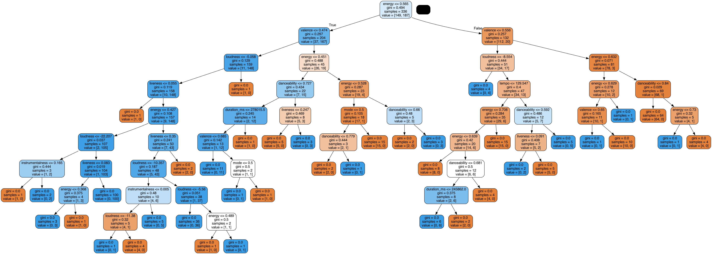

# Music Mate
A music app that analyzes your Spotify listening habits, providing unique insights and machine learning (ML) applications. It includes an interactive Flask website that offers detailed song insights and mood classification based on key song features. The project features a Random Forest model that classifies moods, implemented through a comprehensive ML pipeline involving exploratory data analysis (EDA), feature engineering, hyperparameter tuning, and model evaluation.


 

## Features

- **Spotify Listening Analysis:** Get detailed insights into your Spotify listening habits.
- **Mood Classification:** Uses a Random Forest model to classify the mood of songs based on key features.
- **Interactive Website:** A Flask-based web application for user interaction and visualization of insights.

## Installation

### Prerequisites

- Python 3.6 or higher
- pip (Python package installer)
- Spotify Developer Account (for API access)

### Steps

1. Clone the repository
```
git clone https://github.com/matthewlimm/musicmate
```
2. Create a Python virtual environment
```
python -m venv .venv
source .venv/bin/activate
```
3. Install the dependencies
```
pip install -r requirements.txt
```
4. Set up Spotify API credentials
- Go to the Spotify Developer Dashboard.
- Create a new application to get your Client ID and Client Secret.
- Set up a redirect URI (e.g., http://localhost:5000/callback).
- Create a .env file in the root directory of your project and add the following:
```
SPOTIPY_CLIENT_ID='your-client-id'
SPOTIPY_CLIENT_SECRET='your-client-secret'
SPOTIPY_REDIRECT_URI='http://localhost:5000/callback'
```
4. Run the application
```
flask run --host=0.0.0.0
```
5. Access the application using the following URL
```
http://<IP>:5000
```
